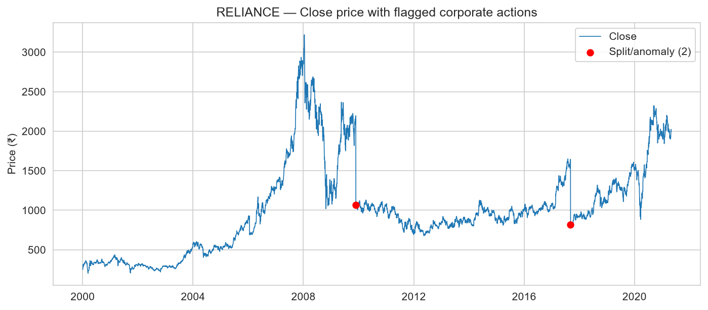
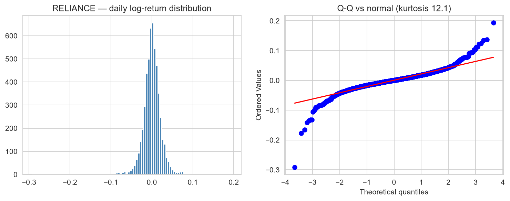
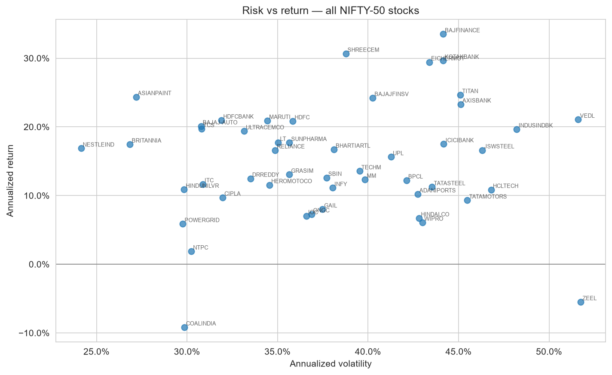
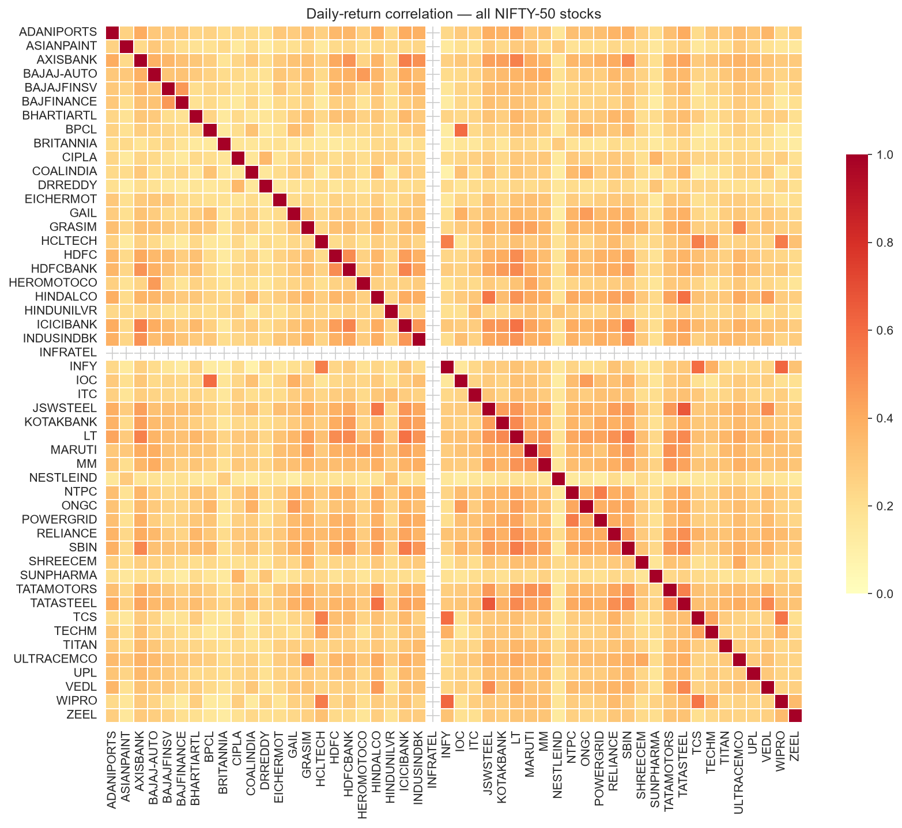
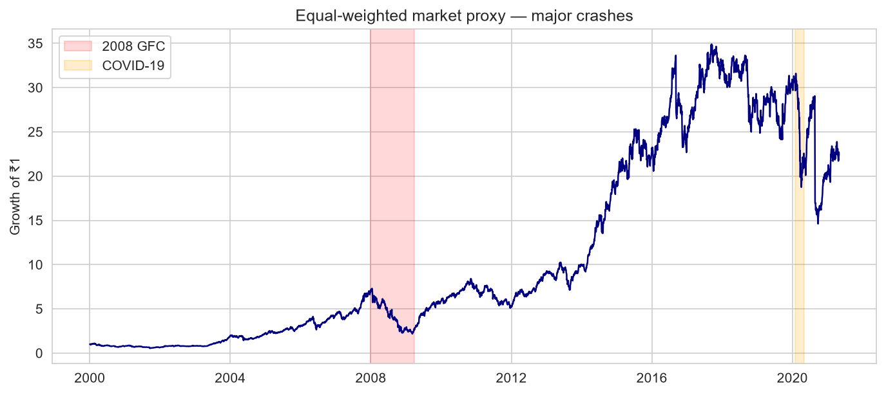
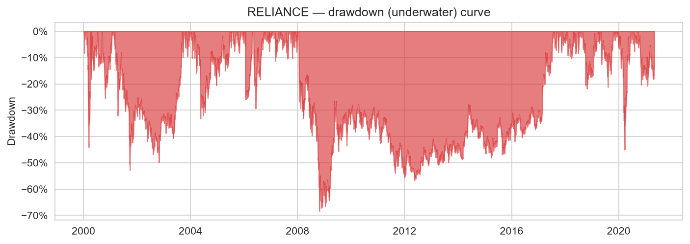
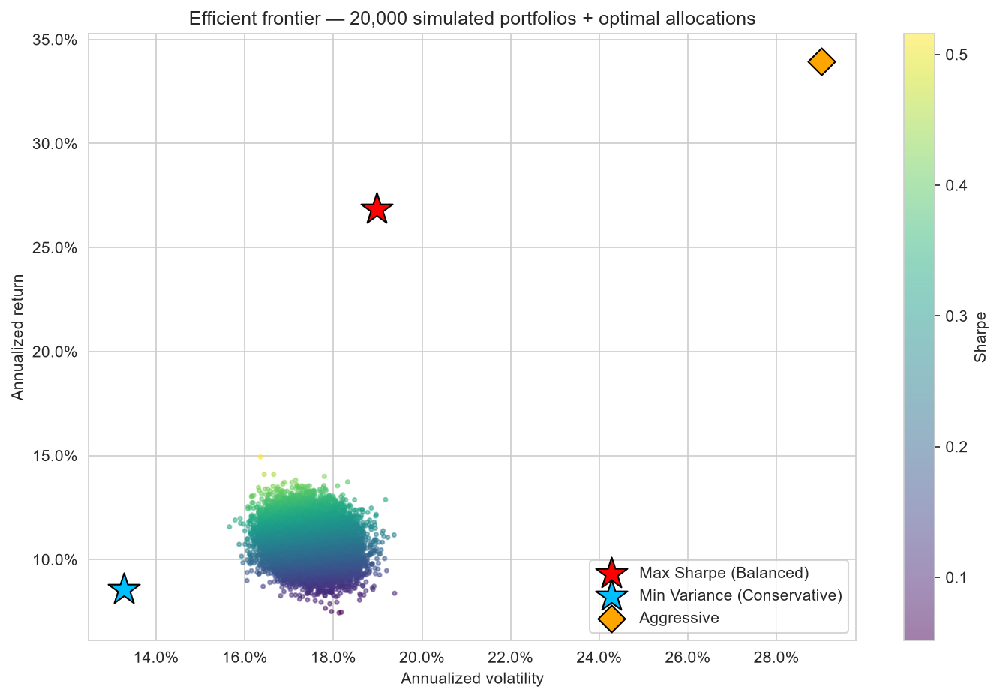
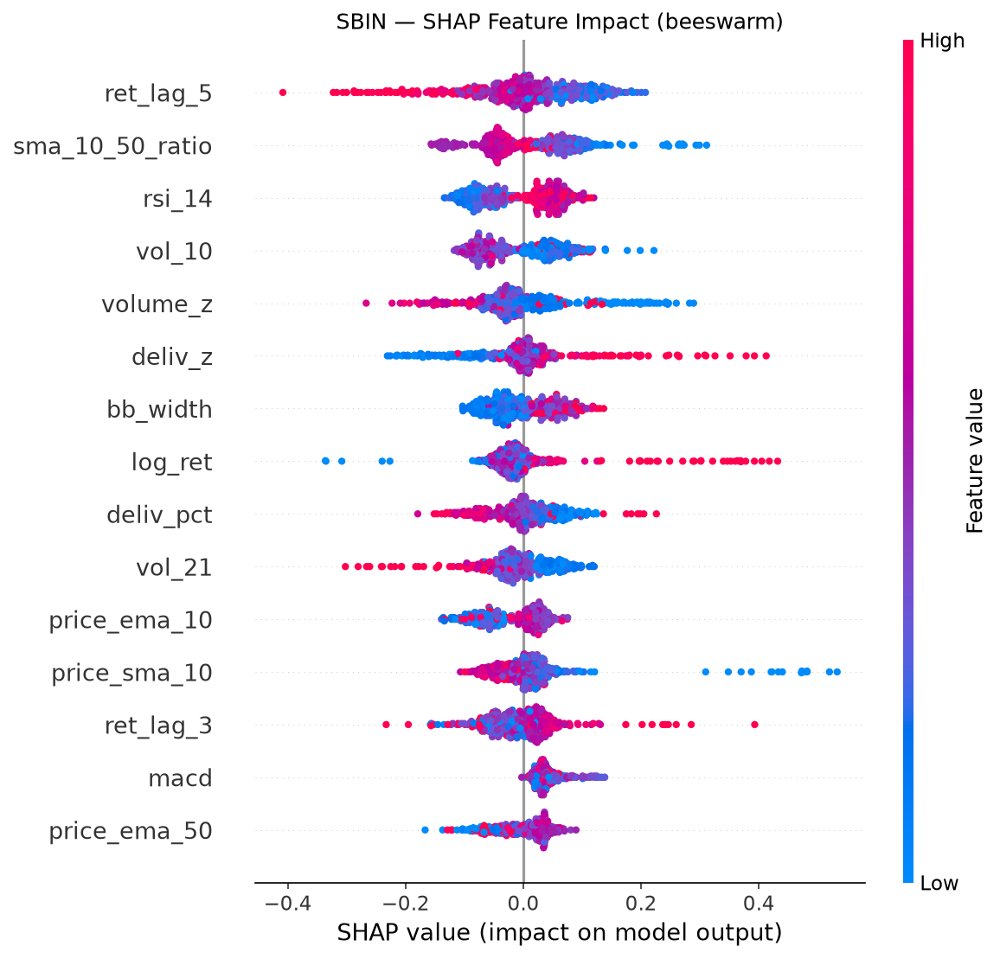
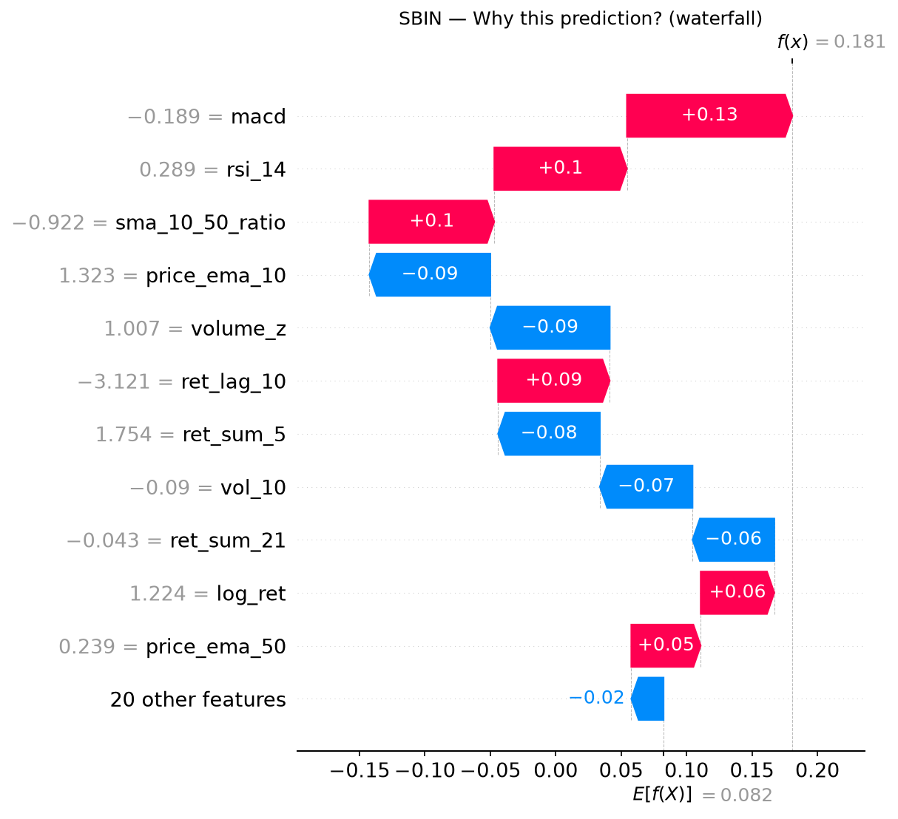

# invest-folio — Data-Driven Investment Intelligence on NIFTY-50

**A decision-support platform for stock prediction, portfolio construction, and risk assessment, built exclusively on historical NIFTY-50 market data.**

*Team: [your names] · IIT Roorkee · Cult Council Open Project*

---

## 1. Introduction & Approach

Financial markets generate enormous volumes of data, yet converting raw price history into actionable decisions remains hard. invest-folio addresses this not as a price-prediction problem but as a **decision-support** problem: the goal is to help an investor *understand and act*, not merely to forecast.

Our system spans the full pipeline — data cleaning, feature engineering, risk analytics, portfolio optimization, machine-learning prediction, and model explainability — exposed through an interactive dashboard. I prioritized leak-free validation and transparent, justified recommendations over impressive-looking but fragile numbers.

**Dataset.** NIFTY-50 daily OHLCV data (Jan 2000 – Apr 2021), 50 stocks across Banking, IT, Energy, FMCG, Pharma, Auto, and more, plus sector metadata. The data includes 15 columns per stock, notably `VWAP`, `Prev Close`, and `%Deliverble` (delivery-to-trade ratio) beyond standard OHLCV.

---

## 2. Exploratory Data Analysis

### 2.1 Data quality: the adjusted-close problem
The dataset provides raw close prices with no split adjustment. Stock splits and bonus issues therefore appear as artificial overnight price collapses. Using the dataset's own `Prev Close` column, we built a detector flagging overnight gaps exceeding 30%. For RELIANCE this flagged exactly two events (Figure 1) — both confirmed corporate actions, not market crashes. I neutralized these days when computing returns, preventing a fake −50% from poisoning every downstream statistic.

*Figure 1 — RELIANCE close price; red markers are detected corporate actions.*

### 2.2 Returns are not normal
Daily log returns exhibit pronounced fat tails and negative skew (Figure 2): RELIANCE shows excess kurtosis of 12.1 (vs 0 for a normal distribution) and skew −0.5. Extreme moves — especially crashes — occur far more often than a Gaussian predicts. This finding directly motivates our risk methodology: we rely on tail-aware measures (Maximum Drawdown, Sortino) rather than standard deviation alone, which assumes normality.

*Figure 2 — Return distribution and Q-Q plot; tails bend sharply away from normal.*

### 2.3 The risk-return landscape
Plotting all 50 stocks in annualized risk-return space (Figure 3) reveals a clear structure. Quality compounders (ASIANPAINT, NESTLEIND, BRITANNIA) occupy the desirable top-left (high return, low risk). High-octane names (BAJFINANCE, EICHERMOT) sit top-right. Critically, not all risk is rewarded: ZEEL carried the highest volatility (~52%) yet *negative* returns, and COALINDIA delivered ~−9%.

*Figure 3 — Annualized risk vs return, all NIFTY-50 stocks.*

### 2.4 Diversification structure
The return-correlation heatmap (Figure 4) shows most pairs are moderately positively correlated (0.2–0.5), with a visibly hotter cluster among financials (AXISBANK, ICICIBANK, HDFCBANK, SBIN) — confirming that loading up on banks is *not* diversification. The least-correlated pairs (e.g. COALINDIA–INFY at 0.09) are the best diversifiers, a finding that directly informs portfolio construction.

*Figure 4 — Daily-return correlation across all stocks.*

### 2.5 Market crashes
An equal-weighted market proxy (Figure 5) makes the 2008 Global Financial Crisis and the 2020 COVID crash vividly visible — the former a deep, slow decline, the latter a sharp V-shape. *(I noted this proxy is survivorship-biased, containing only stocks that remained in the 2021 index, which overstates long-run returns.)*

*Figure 5 — Equal-weighted market proxy with major crashes shaded.*

---

## 3. Feature Engineering

From each stock's OHLCV we engineer ~31 features, all strictly backward-looking to prevent look-ahead bias:

- **Returns & momentum:** log return, lagged returns (1–10 days), multi-day cumulative returns (5/10/21d).
- **Trend:** SMA/EMA at 10/20/50 days, expressed as *price-to-MA ratios* (scale-free, stationary), plus a short-vs-long MA crossover ratio.
- **Momentum oscillators:** RSI(14), MACD with signal and histogram.
- **Volatility:** rolling return std (5/10/21d), normalized ATR(14), Bollinger band width and %B.
- **Volume & conviction:** volume z-score, and — uniquely enabled by this dataset — **delivery-percentage features** (`deliv_pct`, `deliv_z`). The delivery ratio captures genuine investor accumulation versus intraday speculation, a conviction signal most approaches ignore.
- **Calendar:** day-of-week, month.

**Design choice — ratios over raw values.** Price-level features are non-stationary; a ₹100 stock and a ₹3000 stock aren't comparable. Expressing features as ratios ("3% above the 20-day average") makes them stationary and transferable across stocks and time.

**Targets** are built in a separate function from features — a structural firewall ensuring a label can never leak in as a predictor. We predict both next-day direction (classification) and next-day return (regression).

---

## 4. Methodology & Model Architecture

### 4.1 Why gradient-boosted trees, not deep learning
On tabular financial features with a tiny signal-to-noise ratio, XGBoost reliably outperforms LSTMs while remaining fully explainable. Deep networks overfit market noise, demand more data than ~5,000 daily rows provide, and resist interpretation. We therefore use XGBoost as the core engine — the right tool for the problem, and one that pairs natively with SHAP for explainability (Section 7). *(An LSTM benchmark is noted as future work.)*

### 4.2 Leakage discipline
The credibility of any time-series predictor rests on avoiding look-ahead bias. Our protocol:
- **Chronological split** — train on the earliest 80% of dates, test on the most recent 20%. Never shuffled.
- **`TimeSeriesSplit` cross-validation** — each fold trains on past, validates on future (walk-forward).
- **Scaler fit on training data only** — test-set statistics never inform preprocessing.
- **Naive baselines** — direction must beat majority-class prediction; return must beat a zero-change forecast.

### 4.3 Models
Two XGBoost models (max_depth 4, learning_rate 0.03, 300 trees, L2 regularization, subsampling) — deliberately conservative to resist overfitting noise:
- **Classifier** → next-day direction, scored by Directional Accuracy.
- **Regressor** → next-day log return, scored by MAE / RMSE / R² and Information Coefficient.

Hyperparameters were confirmed near-optimal via time-series-aware grid search (tuning only on the training portion, leaving the test set untouched).

---

## 5. Risk Assessment Methodology

For every stock and portfolio we compute a full risk profile from daily returns:

- **Annualized volatility** (σ × √252) — total return dispersion.
- **Sharpe ratio** — excess return per unit of total risk, using a 6.5% risk-free rate (Indian 10-yr G-Sec proxy).
- **Sortino ratio** — excess return per unit of *downside* deviation; penalizes only harmful volatility. Reported alongside Sharpe because, given the negative skew documented in Section 2.2, downside risk is what investors actually fear.
- **Maximum Drawdown** — worst peak-to-trough decline. The most visceral risk measure; the underwater curve (Figure 7) shows RELIANCE fell ~68% from peak during 2008.
- **Beta** — sensitivity to an equal-weighted market proxy; maps directly to investor risk profiles.
- **Calmar ratio & CAGR** — practitioner-standard return-per-drawdown and compounded growth.

*Figure 7 — RELIANCE drawdown (underwater) curve; the 2008 trough reaches −68%.*

A key cross-sectional finding: drawdowns are severe even for quality names (−45% to −96% across the universe), quantifying the fat-tail risk from Section 2 and motivating drawdown-aware portfolio construction.

---

## 6. Portfolio Construction Logic

We construct portfolios over the **45-stock investable universe** (five stocks excluded for data gaps exceeding 30 days: GAIL, INDUSINDBK, INFRATEL, KOTAKBANK, SHREECEM), aligned to a common 2010–2021 window.

### 6.1 Optimization
We combine two engines: a 20,000-portfolio Monte Carlo simulation (for the intuitive efficient-frontier cloud) and exact convex optimization (PyPortfolioOpt) for precise optimal points — cross-validating that both agree. All portfolios are long-only with weights summing to 1 and a 25% per-stock cap to enforce genuine diversification (without the cap, mean-variance optimizers produce unrealistic corner solutions).

### 6.2 Three investor profiles
Optimal portfolios map to investor profiles, each justified quantitatively (Figure 6):

| Profile | Objective | Return | Vol | Sharpe | Max DD | Beta |
|---|---|---|---|---|---|---|
| **Conservative** | Min variance | 11.4% | 13.3% | 0.37 | −25.0% | 0.66 |
| **Balanced** | Max Sharpe | 28.3% | 19.0% | **1.15** | −35.5% | 0.86 |
| **Aggressive** | Max return | 33.9% | 29.0% | 0.95 | −54.5% | 1.17 |

*Figure 6 — Efficient frontier with the three profile portfolios.*

The progression is a clean risk ladder: return, volatility, drawdown, and beta all rise monotonically while holdings concentrate (21 → 7 → 3 stocks). The Conservative portfolio tilts toward defensive FMCG/utility names (NESTLEIND, POWERGRID, HINDUNILVR) with beta 0.66; the Aggressive concentrates in high-growth finance/auto (BAJFINANCE, BAJAJFINSV, EICHERMOT).

A deliberate insight: Aggressive earns 5.6% more return than Balanced but its Sharpe falls (0.95 vs 1.15) — chasing raw return past the Sharpe-optimal point adds risk faster than reward. The system surfaces this tradeoff rather than hiding it.

---

## 7. Stock Prediction & Explainability

### 7.1 Results: predictability is real but concentrated
Across the 45-stock universe, mean directional accuracy is 50.3% against a 50.5% baseline — i.e. on average, daily direction is unpredictable, exactly as the Efficient Market Hypothesis predicts. This near-zero average edge is, paradoxically, evidence of a leak-free pipeline: a model claiming high universe-wide accuracy would signal look-ahead bias.

The decision-support value lies in the heterogeneity. Predictability is concentrated in specific names:

| Stock | Dir. Accuracy | Baseline | Edge |
|---|---|---|---|
| MARUTI | 53.9% | 48.4% | **+5.5%** |
| CIPLA | 51.2% | 45.8% | **+5.4%** |
| BRITANNIA | 53.2% | 49.8% | +3.4% |
| SBIN | 52.6% | 49.3% | +3.3% |
| RELIANCE | 53.9% | 51.7% | +2.2% |

19 of 45 stocks beat their baseline; 8 exceed 52% directional accuracy. The system's role is therefore to identify where technical signals carry information — and, equally important, to flag where they do not (e.g. BAJAJ-AUTO, WIPRO, INFY underperform baseline), preventing false confidence. Return-magnitude R² is near zero throughout (mean −0.06), confirming that magnitude is dominated by noise even where direction is mildly predictable.

### 7.2 Explainability with SHAP
Every prediction is decomposed via SHAP (exact TreeExplainer for XGBoost). Globally (Figures 8–9, for SBIN), the most influential features are short-term momentum (`ret_lag_5`), trend regime (`sma_10_50_ratio`), RSI, volatility, and — notably — our **delivery-conviction features** (`deliv_z`, `deliv_pct`), which outrank conventional indicators like MACD and ATR. This validates the conviction-signal hypothesis: order-flow data carries information beyond price and volume.

*Figure 8 — SHAP beeswarm: feature impact and direction. High delivery conviction (red, `deliv_z`) pushes predictions bullish.*

Locally, each prediction yields a plain-English rationale (Figure 10) — e.g. "*SBIN predicted DOWN: delivery conviction faded and recent momentum is weak, despite neutral RSI*." This is the core of decision support: users see *why*, not just *what*.

*Figure 10 — SHAP waterfall decomposing a single prediction.*

---

## 8. Key Insights, Limitations & Conclusion

### Key insights
1. **Raw data hides corporate actions** — split detection via `Prev Close` is essential; naive returns would embed fake −50% days.
2. **Returns are fat-tailed and negatively skewed** (kurtosis 12) — justifying drawdown- and downside-focused risk measures.
3. **Diversification is structural** — financials move together; the best diversifiers are cross-sector pairs (COALINDIA–INFY, 0.09).
4. **Not all risk is rewarded** — ZEEL and COALINDIA carried high/negative-return profiles (value traps).
5. **Daily direction is unpredictable on average but exploitable in specific stocks** — MARUTI, CIPLA, BRITANNIA, SBIN show persistent 3–5.5% edges.
6. **Delivery conviction is a genuine signal** — `deliv_z`/`deliv_pct` rank among the top predictive features.

### Limitations (honest disclosure)
- **Survivorship bias:** the universe contains only stocks in the 2021 index, overstating long-run returns.
- **In-sample optimization:** portfolio allocations assume historical risk/return relationships persist — a known limitation of mean-variance optimization. They are illustrative, not investment advice.
- **Thin predictive edge:** directional accuracy edges are small and unstable; the predictor is one input among several, not a standalone trading signal.
- **No transaction costs or rebalancing** modeled.

### Conclusion
invest-folio delivers an end-to-end, explainable decision-support platform that transforms raw NIFTY-50 data into risk-aware, justified investment intelligence. Its defining choice is **honesty**: leak-free validation, transparent SHAP explanations, and frank disclosure of where the models add value and where they do not — which is precisely what trustworthy decision support requires.

---